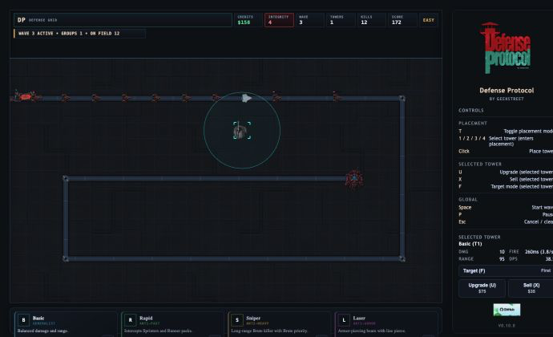

# Defense Protocol

Defense Protocol is a mechanics-first, endless tower-defense game built in the
GeekLabs sandbox. This repository is the shared Phaser/Vite game core for the
live web edition and the Capacitor iOS app.



[Play Defense Protocol](https://play.geeklabs.io) ·
[GeekLabs](https://geeklabs.io) ·
[Field guide](https://geeklabs.io/guide/defense-protocol) ·
[Support](https://geeklabs.io/support/defense-protocol) ·
[Privacy](https://geeklabs.io/privacy/defense-protocol)

## Status

| Target | State |
| --- | --- |
| Web | Live at `play.geeklabs.io` |
| iPhone and iPad | Capacitor foundation accepted; final release validation remains |
| Current release | `v0.10.0` production graphics pass |

The accepted gameplay baseline combines long-form endless play, gentle early
onboarding, and increasing strategic pressure without changing the web and
mobile rules independently.

## Highlights

- Easy, Medium, and Hard endless modes with concurrent waves
- Basic, Rapid, Sniper, and Laser towers with upgrades and targeting modes
- Runner, Sprinter, Brute, and Armored enemy progression
- responsive desktop, short-laptop, iPhone, and iPad landscape layouts
- keyboard, mouse, and touch controls built on one semantic action layer
- industrial-science-fiction production art with procedural fallbacks
- local scores plus an optional same-origin global leaderboard
- deterministic wave composition, telemetry, and progression regression tests

The [player field guide](https://geeklabs.io/guide/defense-protocol) contains
the progression milestones, tower and enemy roles, controls, and touch-play
instructions.

## Quick start

Use Node.js 22 and npm, then run:

```bash
npm ci
npm run dev
```

Vite prints the local development URL. Common validation commands are:

```bash
npm test
npm run build
npm run ios:sync
npm run ios:validate
```

## Deployment

Production is served by an Nginx game container behind the shared GeekLabs
gateway and Cloudflare Tunnel. Browser leaderboard calls remain same-origin at
`/api/*`; the API, gateway, public site, and persistent data are maintained in
the separate `geeklabs-site` deployment repository.

`npm run deploy` is a production operation. It requires a clean, reviewed
`main` branch, pushes the exact commit to Forgejo, updates the VM checkout,
rebuilds the game container, and performs public health checks. It does not
mirror the commit to GitHub. Read
[`docs/context/WORKFLOW.md`](docs/context/WORKFLOW.md) before using it.

## Technology

- Phaser 3 and modern JavaScript modules
- Vite production builds
- Capacitor 8 for the iOS shell and native preference bridge
- Node's built-in test runner
- Docker Compose, Nginx, and Cloudflare Tunnel in production
- same-origin leaderboard service backed by SQLite in the deployment stack

## Project context

Forgejo is the authoritative repository and GitHub is a secondary public
mirror. Git and the source code remain authoritative; the maintained documents
under [`docs/context/`](docs/context/README.md) explain current state,
architecture, decisions, roadmap, validation evidence, and deployment workflow.

Portable ZIP exports are optional transport artifacts, not a parallel source of
truth. See
[`docs/context/PORTABLE_EXPORT.md`](docs/context/PORTABLE_EXPORT.md).

## License

See [`LICENSE`](LICENSE).
